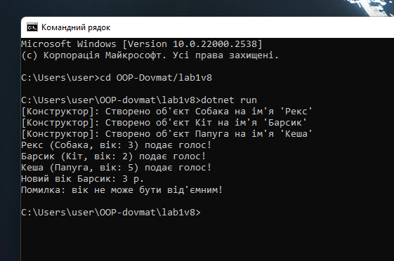

Звіт з лабораторної роботи №1

З дисципліни: Об’єктно-орієнтоване програмування

Тема: Створення першого проєкту. Класи, об’єкти, конструктори та деструктори. Середовище розробки

Студент: [Довмат Максим]

Група: [кн-3-1]

Варіант: №8 animal

Навчальний заклад: Рівненський фаховий коледж інформаційних технологій

 Мета роботи

Ознайомитися з середовищем розробки Visual Studio Code та інструментарієм .NET SDK. Навчитися створювати класи, об'єкти, використовувати інкапсуляцію, конструктори, деструктори та базові елементи ООП у мові C#. Опанувати базові навички роботи з системою контролю версій Git та сервісом GitHub.

 
 
 
 Відповіді на контрольні запитання

Що таке клас та об’єкт? Яка між ними різниця?

Клас — це абстрактний чертеж або шаблон, який описує структуру (поля) та поведінку (методи) певного типу даних.

Об'єкт — це конкретний екземпляр класу, який існує в пам’яті та має власні реальні значення полів.

Різниця: Клас існує у вигляді коду та концепції, тоді як об'єкт займає конкретне місце в оперативній пам'яті під час виконання програми.

Для чого використовуються конструктори? Чи може клас існувати без них?

Конструктор використовується для автоматичної ініціалізації початкового стану об'єкта під час його створення за допомогою оператора new.

Чи може існувати без нього: Так, якщо розробник явно не створює конструктор, компілятор C# автоматично генерує безпараметричний конструктор за замовчуванням, який заповнює поля значеннями за замовчуванням (0, null, false).

Чим відрізняється приватне поле від публічної властивості? Навіщо потрібна інкапсуляція?

Приватне поле (private) зберігає внутрішні дані об'єкта та доступне лише з середини даного класу.

Публічна властивість (public property) є безпечним інтерфейсом доступу до приватного поля через блоки get (зчитування) та set (запис).

Інкапсуляція необхідна для захисту внутрішнього стану об'єкта від непроханих чи некоректних змін ззовні (наприклад, для перевірки/валідації того, щоб вік тварини Age не був від'ємним).

 Висновок

Під час виконання лабораторної роботи №1 було створено та відналагоджено консольний проєкт мовою C# в середовищі VS Code. Застосовано концепції ООП: інкапсуляцію, використання приватних полів, публічних властивостей з перевіркою значень, конструкторів за замовчуванням та з параметрами, а також методів. Опановано базові команди роботи з Git і завантаження проєкту на GitHub.