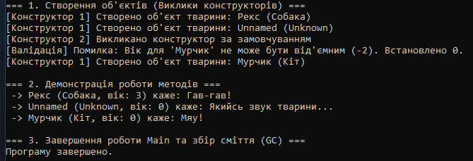

##ЗВІТ
з лабораторної роботи №2
з дисципліни «Об'єктно-орієнтоване програмування»
Тема: Клас із кількома конструкторами. Життєвий цикл об’єкта.

Варіант: Клас 8
 Посилання на GitHub-репозиторій
 https://github.com/maks1dv/OOP-Dovmat/tree/main/lab2v8

 ##Висновок
Під час виконання лабораторної роботи було освоєно механізм перевантаження конструкторів та досліджено життєвий цикл об'єкта в C#. Використання синтаксису : this(...) дозволило створити ланцюговий виклик конструкторів, що мінімізує дублювання коду та забезпечує єдину точку ініціалізації. Досліджено три етапи життя об'єкта: виділення пам'яті в купі через new, використання об'єкта та його очищення автоматичним збирачем сміття (Garbage Collector), який запускає фіналізатор (~Pet()) перед знищенням недосяжних об'єктів.
Що таке перевантаження конструкторів і яку перевагу воно дає?

##контрольні запитання 

Це створення кількох конструкторів із різними параметрами в одному класі. Це надає гнучкість — об'єкт можна створювати як з повним набором даних, так і з мінімальним.

Як за допомогою : this() можна уникнути дублювання коду ініціалізації?

Завдяки : this(...) один конструктор передає виконання іншому (основному) конструктору того ж класу. Вся логіка ініціалізації зберігається в одному місці.

Хто і в який момент викликає деструктор (фіналізатор) у C#?

Його викликає Збирач сміття (Garbage Collector) автоматично, коли об'єкт втрачає всі посилання і підлягає видаленню з пам'яті. Точний час виклику невизначений.

Чому в реальних програмах не рекомендується викликати GC.Collect() вручну?

Це зупиняє виконання програми (паузи Stop-the-World) і збиває внутрішні алгоритми оптимізації GC, що суттєво знижує продуктивність.
