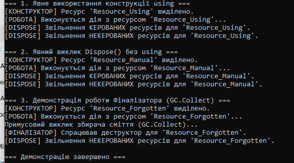

ЗВІТ
з лабораторної роботи №3
Тема: Життєвий цикл об’єкта та керування ресурсами

Варіант: №8 (TemporaryFile)

1. Посилання на GitHub-репозиторій
https://github.com/maks1dv/OOP-Dovmat/tree/main/lab3v8
2. Висновок
Під час виконання лабораторної роботи було досліджено життєвий цикл об’єкта в .NET та способи керування ресурсами за допомогою інтерфейсу IDisposable та патерну Dispose.

За результатами трьох продемонстрованих сценаріїв у Main можна зробити такі висновки про їх відмінність:

Оператор using: забезпечує детерміноване (миттєве) звільнення ресурсів одразу після виходу з блоку коду, гарантуючи виклик Dispose() навіть у випадку виникнення виняткових ситуацій. Це найбезпечніший і найбільш рекомендований підхід у C#.

Явний виклик Dispose() (в блоці try...finally): дає такий самий детермінований результат, як і using, але вимагає від розробника більше синтаксичного коду.

Об'єкт без Dispose() (недетермінована фіналізація): якщо Dispose() не викликано явно, вивільнення некерованих ресурсів відкладається до моменту спрацьовування Garbage Collector (деструктора ~TemporaryFile()). Це може призвести до перевитрати системних ресурсів або витоку пам'яті. Виклик GC.SuppressFinalize(this) при детермінованому виклику Dispose() дозволяє уникнути зайвої роботи GC та покращує продуктивність програми.

Відповіді на контрольні запитання (до захисту)
1. Що таке життєвий цикл об’єкта в .NET?

Це послідовність етапів, які проходить об'єкт від моменту створення до видалення з пам'яті:

Виділення пам'яті в купі (Heap) та виконання конструктора.

Активне використання через посилання.

Втрата посилань на об'єкт (об'єкт стає недосяжним).

Фіналізація (виклик деструктора ~ClassName(), якщо він є) та збирання сміття (GC звільняє пам'ять).

2. Яка різниця між керованими та некерованими ресурсами?

Керовані ресурси (Managed): пам'ять під звичайні .NET об'єкти (string, List, власні класи), видаленням якої повністю і автоматично займається Garbage Collector.

Некеровані ресурси (Unmanaged): ресурси операційної системи (дескриптори файлів, відкриті файли на диску, мережеві сокети, з'єднання з базою даних, Win32 API handles), про вивільнення яких розробник повинен подбати явно.

3. Для чого призначений інтерфейс IDisposable?

Він є стандартним механізмом у .NET для явного, детермінованого (негайного) звільнення некерованих та керованих ресурсів об'єкта до того, як спрацює збирач сміття.

4. Як оператор using допомагає в керуванні ресурсами?

Оператор using є синтаксичним цукром для конструкції try { ... } finally { resource.Dispose(); }. Він гарантує, що метод Dispose() буде викликано при виході з блоку using, навіть якщо всередині виникла помилка (виняток).

5. Навіщо в патерні Dispose використовується метод GC.SuppressFinalize()?

Цей метод інформує Garbage Collector, що деструктор (фіналізатор) даного об'єкта викликати більше не потрібно, оскільки всі ресурси вже були очищені вручну через Dispose(). Це прискорює очищення пам'яті та економить ресурси процесора.

6. Чому в деструкторі викликається Dispose(false), а в методі Dispose() — Dispose(true)?

При Dispose(true) (виклик з Dispose()) ми знаємо, що об'єкт знищується свідомо: можна безпечно очищати і керовані, і некеровані ресурси.

При Dispose(false) (виклик з деструктора/GC) керовані об'єкти вже могли бути видалені збирачем сміття раніше, тому звертатися до них небезпечно. У цьому випадку очищаються ЛИШЕ некеровані ресурси.
