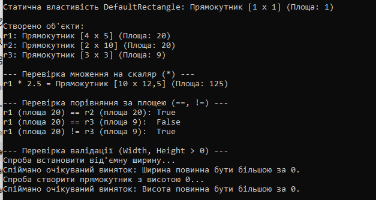

# Звіт з лабораторної роботи №4

**Тема:** Властивості та статичні члени. Індексатори й перевантаження операторів  
**Дисципліна:** Об'єктно-орієнтоване програмування  
**Виконав:** студент групи [кн-3-1] Довмат [Максим]  
**Варіант:** №8 (`Rectangle`)  

---

## Мета роботи
Навчитися реалізовувати властивості з перевіркою, використовувати статичні члени класу, а також застосовувати індексатори та перевантажувати оператори для створення більш виразних та зручних класів.

---

## Завдання (Варіант №8)
Реалізувати клас `Rectangle` з наступними членами:
* **Поля:** `_width`, `_height` (`double`).
* **Властивості:** `Width`, `Height` (з валідацією: значення повинні бути `> 0`).
* **Статичний член:** `DefaultRectangle` (статична властивість, що повертає `Rectangle(1,1)`).
* **Перевантажені оператори:**
  * `*` (множення на скаляр, що змінює розміри прямокутника);
  * `==`, `!=` (порівняння прямокутників за площею).
* **Перевизначені методи:** `ToString()`, `Equals()`, `GetHashCode()`.
Контрольні запитання
1. Яка різниця між звичайною властивістю та індексатором?

Звичайна властивість описує окремий атрибут об'єкта та викликається за іменем (rect.Width). Індексатор дозволяє звертатися до об'єкта за допомогою квадратних дужок [] із передачею одного чи кількох аргументів-індексів (object[index]), як до масиву чи колекції.

2. Навіщо потрібно перевизначати Equals() та GetHashCode() при перевантаженні операторів == та !=?

Це необхідно для забезпечення єдиної логіки порівняння об'єктів. За замовчуванням == порівнює посилання в пам'яті. Якщо перевантажити ==, але не перевизначити Equals(), результати a == b та a.Equals(b) будуть відрізнятися. Перевизначення GetHashCode() гарантує, що рівні об'єкти матимуть однаковий хеш-код, що важливо для коректної роботи у хеш-колекціях (HashSet, Dictionary).

3. У яких випадках доцільно використовувати статичні члени класу?

Статичні члени доцільно використовувати для:

Зберігання спільного стану чи даних для всіх об'єктів (наприклад, константи чи лічильники екземплярів);

Допоміжних методів-утиліт, що не залежать від конкретного екземпляра класу;

Реалізації фабричних методів чи отримання стандартних значення за замовчуванням (Rectangle.DefaultRectangle).

4. Як інкапсуляція допомагає підтримувати цілісність даних у класі, який ви реалізували?

Інкапсуляція приховує приватні поля _width та _height від прямого зовнішнього втручання. Доступ до них надається через властивості Width та Height, де в сеттерах реалізована перевірка (value <= 0). Завдяки цьому об'єкт Rectangle ніколи не може опинитися у некоректному стані (з від'ємними чи нульовими розмірами).
