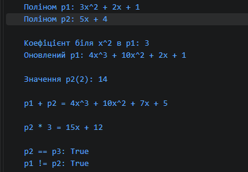

## Лабораторна робота №5
**Тема:** Індексатори та перевантаження операторів  
**Дисципліна:** Об'єктно-орієнтоване програмування  
**Варіант:** 8 (Клас `Polynomial`)  

## Мета роботи
Навчитися створювати індексатори для доступу до елементів класу за індексом або ключем та розширити функціональність класів через перевантаження операторів для створення більш виразного та зрозумілого коду.

## Завдання за варіантом (Варіант 8)
Реалізувати клас **`Polynomial`** (Поліном):
* **Поле:** `double[] _coefficients` (коефіцієнти за степенями $x^0, x^1, x^2, \dots$).
* **Індексатор:** `this[int degree]` для доступу до коефіцієнта за відповідним степенем.
* **Перевантажені оператори:** 
  * `+` — додавання двох поліномів;
  * `*` — множення полінома на скаляр;
  * `==` та `!=` — порівняння поліномів.
* **Перевизначені методи:** `ToString()`, `Equals()`, `GetHashCode()`.
* **Додатковий метод:** `Evaluate(double x)` — обчислення значення полінома при заданому значення $x$.

1. Що таке індексатор і для чого він використовується?

Це член класу, що дозволяє звертатися до об'єкта через квадратні дужки (obj[index]), як до масиву чи словника.

2. Яка різниця між індексатором та звичайною властивістю?

Індексатор оголошується через слово this, обов'язково приймає параметр в дужках [...] і не буває статичним (static).

3. Які оператори можна перевантажувати в C#?

Арифметичні (+, -, *, /, %), унарні (++, --, !), побітові (&, |, ^) та порівняння (==, !=, <, >, <=, >=).

4. Чому при перевантаженні == та != необхідно перевизначити Equals() і GetHashCode()?

Для єдиної логіки порівняння в .NET та коректної роботи об'єктів у хеш-колекціях (HashSet, Dictionary).

5. Як індексатори підвищують читабельність коду?

Замінюють довгі виклики методів (наприклад, GetCoeff(i)) на коротку та інтуїтивну нотацію obj[i].
