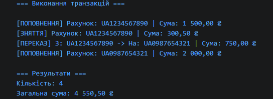

# Лабораторна робота №8
**Тема:** Поліморфізм: динамічне зв’язування та перевизначення методів  
**Дисципліна:** Об'єктно-орієнтоване програмування  
**Варіант:** 8 (Банківські операції: `Transaction` → `Deposit`, `Withdrawal`, `Transfer`)  

## Мета роботи
Навчитися реалізовувати поліморфну поведінку за допомогою віртуальних методів та їх перевизначення, а також агрегувати результати поліморфних викликів.

## Ієрархія класів
* **`Transaction`** (базовий клас):
  * Поле/Властивість: `Amount` (сума транзакції).
  * Метод: `virtual void Execute()`.
* **`Deposit`** (похідний клас):
  * Властивість: `DestinationAccount`.
  * Перевизначає `Execute()` для обробки поповнення.
* **`Withdrawal`** (похідний клас):
  * Властивість: `SourceAccount`.
  * Перевизначає `Execute()` для обробки зняття коштів.
* **`Transfer`** (похідний клас):
  * Властивості: `FromAccount`, `ToAccount`.
  * Перевизначає `Execute()` для обробки переказу між рахунками.

1. Що таке поліморфізм і як він реалізується в C# за допомогою virtual та override?

Поліморфізм — це здатність об'єктів різних класів виконувати один і той самий метод по-різному. В C# метод базового класу позначається як virtual, а в похідних класах перевизначається за допомогою override.

2. Поясніть поняття динамічного зв’язування. Чим воно відрізняється від статичного?

Динамічне (пізнє) зв'язування визначає, який саме метод викликати, під час виконання програми (за фактичним типом об'єкта). Статичне зв'язування відбувається на етапі компіляції (за типом змінної).

3. Наведіть приклад, як поліморфізм дозволяє писати більш гнучкий та розширюваний код.

Він дозволяє додавати нові типи транзакцій (наприклад, Payment) без зміни існуючого коду обробки, оскільки функція обробки працює з базовим типом Transaction.

4. Які переваги дає використання колекцій базових типів для роботи з поліморфними об’єктами?

Дозволяє зберігати всі різновиди об'єктів у єдиній колекції (List<Transaction>) та обробляти їх в одному циклі без перевірок типів чи явного приведення.
